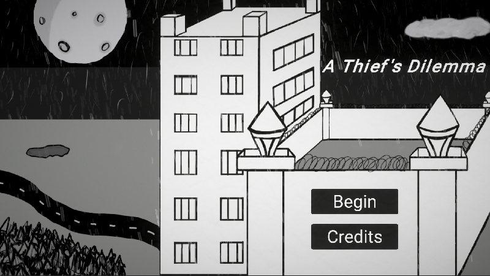
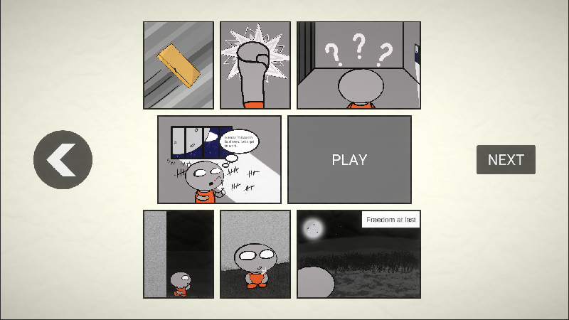
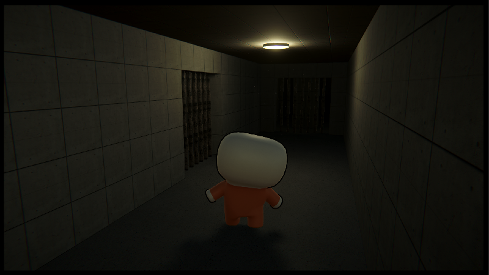
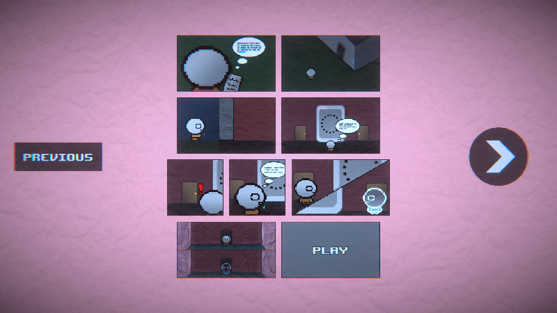
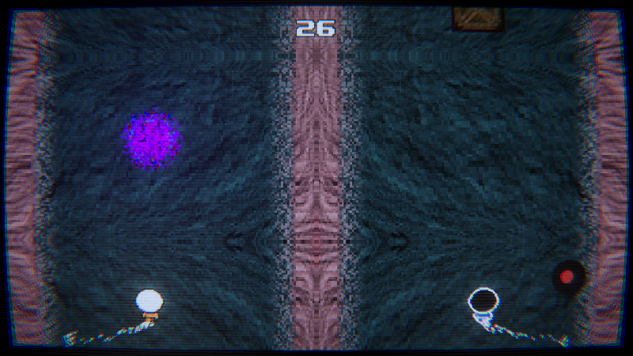
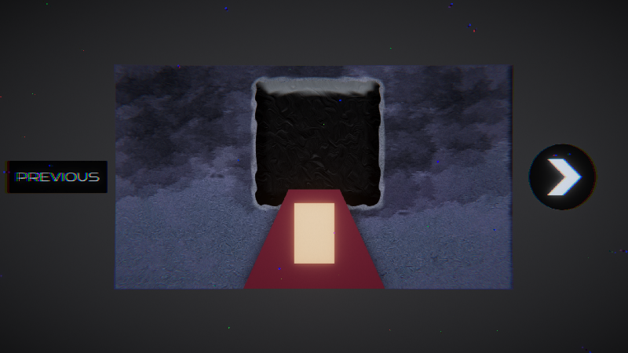
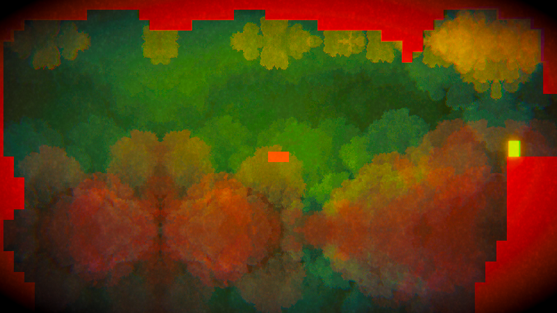

<h1 align="center">
 
A Thief's Dilemma
</h1>

<h3 align="center"><a href="https://drive.google.com/file/d/1HaYi_ioxv9Fiv7QjSb3F0wWn4iK26pZY/view?usp=sharing">Artifact Video</a></h3>

<h3 align="center"><a href="https://www.boisestate.edu/gimm/">GIMM</a> 250 - Interactive Storytelling </h3>
<h5 align="center"><a href="https://www.boisestate.edu/">Boise State University</a> (Spring 2023) </h5>

<h4 align="center">An interactive comic that explores the concepts of quantum mechanics on a larger scale.</h4>

  <a href="#project-overview">Project Overview</a> •
  <a href="#project-showcase">Project Showcase</a> •
  <a href="#technical-stack">Technical Stack</a> •
  <a href="#collaborators">Collaborators</a> •
  <a href="#contact">Contact</a>

## Project Overview

A story-based interactive comic book about a master thief who has access to powers related to quantum mechanics. As the thief loses his perception of reality over time, the art style, and the unique games connected to each of the three sections, devolve into further abstract visuals and mechanics.

## Project Showcase

### Act 1

<h4>Story:</h4>

The first act of A Thief's Dilemma stories the prison escape of our protagonist, Mac. He is a master thief that can use quantum powers through the use of mysterious pills. He receives the opportunity to escape using one of these pills, as long as he agrees to one last job...

<h4>Style:</h4>

As our story starts off relatively normal, the art style is primarily a black and white, hand-drawn look. The game for this section is the prison break of the act. This is shown through a 3D, maze-like prison that the player has to navigate through.

<h4>Quantum Mechanic Focus:</h4>

The quantum mechanic we explored in this act was <strong>Wave Particle Duality</strong>. This is represented through the player being able to turn from their normal particle form to a wave-based form that distorts the world around them. When in this wave form, Mac can move through various cell bars to progress further through the prison.

<h4>Comic:</h4>

<h4>Game:</h4>

### Act 2

<h4>Story:</h4>

Act 2 delves into the heist that centers our story, as well as our protagonist's future. At this point, the use of the pills have begun to distort Mac's perception of reality.

<h4>Style:</h4>

As a result, the art has now become pixel art, with the central game mechanic being an "endless" runner of avoiding obstacles.

<h4>Quantum Mechanic Focus:</h4>

The quantum mechanic we explored in this act was <strong>Quantum Entanglement</strong>. This is represented through the protagonist splitting himself into two, with the copy being an opposite of himself. This makes the "endless" runner game section more difficult, as you have to focus on two runners at the same time, with each reacting to controls in opposite ways.

<h4>Comic:</h4>

<h4>Game:</h4>

### Act 3

<h4>Story:</h4>

The final act of our story finds our protagonist after his successful heist. However, with the success of stealing his target prize, he finds himself completely losing his perception of reality, leading to dire consequences.

<h4>Style:</h4>

By this point, Mac now sees the world in an abstract, 2D point of view. The world changes visually almost constantly, and the foreground is made of simple shapes, to the point where nothing is concrete. The central game mechanic is now a 2D side scrolling platformer, with the ability to reverse time.

<h4>Quantum Mechanic Focus:</h4>

The quantum mechanic we explored in this act was the <strong>Flow of Time</strong>. This is represented through a mechanic of reversing Mac through his previous locations of up to 10 seconds. Through this mechanic, the player is able to progress through a series of difficult rooms and puzzles, and hopefully avoid the madness that comes with it.

<h4>Comic:</h4>

<h4>Game:</h4>

### End

At the end of Mac's journey, he realizes that his newfound freedom is not worth the distorted world that he now finds himself in. As a result, he decides to use this newfound time-reversal to undo everything that has happened, sending the player, and himself, back to the very beginning of our story.

## Technical Stack

 

## Collaborators

<h3>Carson Strout:</h3>

Project Leader • Lead Programmer • Artist • Animator • 3D Modeler • Level Designer • Sound Designer

<h3>Sam Lummus:</h3>

Writer • Artist • Animator

<h3>Kevin Sherwood:</h3>

Artist • Animator

<h3>Hank Davidson:</h3>

Sound Designer • Level Designer

## Contact

<h3>Carson Strout</h3>

 </a>
 

<h3>Sam Lummus</h3>

<h3>Kevin Sherwood</h3>

 </a>

<h3>Hank Davidson</h3>

<!-- # Quantum Comic
Interactive Comic based on Quantum Mechanics -->
